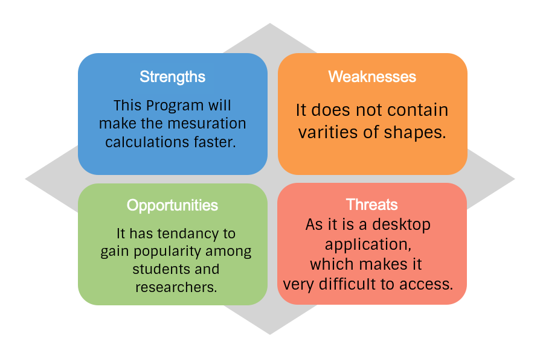

# Requirements

## Introduction
 

Mensuration is useful about the measurement of shapes and figures. It is applicable with 2-D and 3-D geometrical shapes both. Using a specific mensuration formula from the many, we will able to solve the mensuration problems easily. So let us see these concepts of mensuration and their formulas.

If a shape is surrounded by three or more straight lines in a plane surface, then it is a 2-D shape. And such shapes are having only length and breadth. If a shape is surrounded by a no. of surfaces or planes then it is termed as 3-D shape. These are having depth, breadth, and length.

As Humans have to do lots of work to measure the different parameters of the given shapes. As this task is repetative and a machine can easily handle all these task of calculation.
This project uses different formulas to calculate different parameters of the shape, area and volume of the given object.
## Research
The basic formulas related to  the measurement of the area , volume and the other formulas used in mensuration is collected.

### Benefits
This will help to calculate the The parameters of a shape in a faster way by using a predefined formulas of mensuration. One just have to give the recorder parameters and the other parameters will automatically shown up.

## Cost and Features with Time
* Mensuration calculater are there since the beginning of the computer era, but the features it promises makes the change.
* Many calculators promises only few specific shapes and some can also work with advance geometric shapes.
* In this project we are going to focus on the basic geometri shapes but with more parameters included.

## Defining Our System
* program will ask on which shape are you going to work, 2D or 3D.
* Then it will give options for the save for the given catogary.
* user can select a shape and then enter the observed parameters of the shape
* The user will get the desired result.

## SWOT ANALYSIS

# 4W's and 1'H

## Who:
* Researchers who want to calculate the different mensuration parameters in the faster way.
* Students who are learning the concepts of mensuration.

## What:
* Mensuration calculator is a program that will help to calulate different mensuration parameters in the faster way.

## When:
* This project is part of LnT STEPin SDLC Activity Based Learning.

## Where:
* This program can run on any desktop Environment.

## How:
* Written in C Programming language using VSCode in linux environment.
